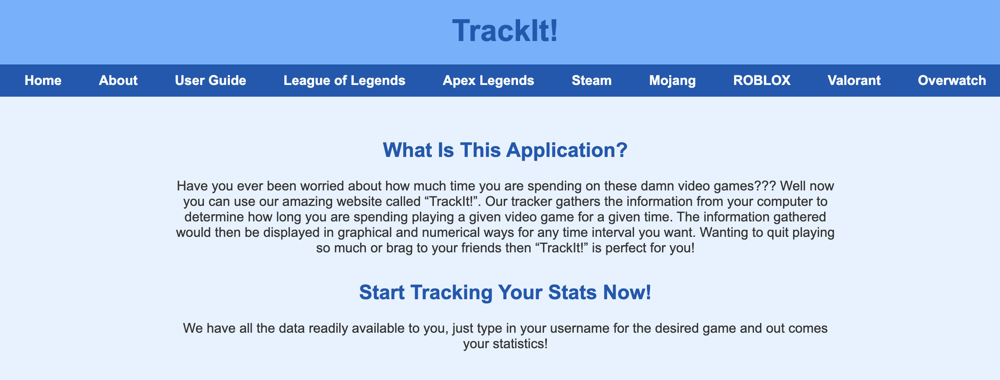

# TrackIt
TrackIt is a gamer-focused utility web application that allows gamers to track their stats across tons of games in one centralized place!

TrackIt is a gaming stat website that tracks the stats that gamers have from various games when the user inputs information such as usernames. Our website then uses the respective video game APIs to get the stats and images that correspond to the user's profiles. 

## How to use
To get started, you can first clone this repository using

    git clone https://github.com/ZaafirUlHasan/TrackIt.git

Now, you will have a folder called TrackIt. To launch the app, you can run the following commands:

    cd TrackIt
    cd TrackIt
    python3 app.py

You can also run app.py in any other way you like for e.g in VSCode.
You will get a message like this in the terminal:

    * Serving Flask app 'app'
    * Debug mode: on
    WARNING: This is a development server. Do not use it in a production deployment. Use a production WSGI server instead.
    * Running on http://127.0.0.1:5000
    Press CTRL+C to quit
    * Restarting with stat
    * Debugger is active!
    * Debugger PIN: 564-246-652

You can now copy the link from 'Running on {link}'(http://127.0.0.1:5000 in this case) into your browser to launch the application.

## Support
You can contact our team at our emails: zuh23@drexel.edu, etp44@drexel.edu, ch3436@drexel.edu, jj3249@drexel.edu

## Roadmap
We continuously improved our website in an agile environment from January 2023 - June 2023. As of now, this project will no longer recieve any updates.

## Contributing
We are not open to contributions from the general public as this project is made as part of the CI102/CI103 classes at Drexel University. 

## Authors and acknowledgment
This project was created by our project owner, Evan Palubinski, frontend developer, Connie Ha, first backend developer, Joel Jins, and full stack developer Zaafir Ul Hasan. 

## License
Our project is jointly owned by the four members of our team. 

## Project status
Our project is no longer under develop and has ceased development since June 2023.

